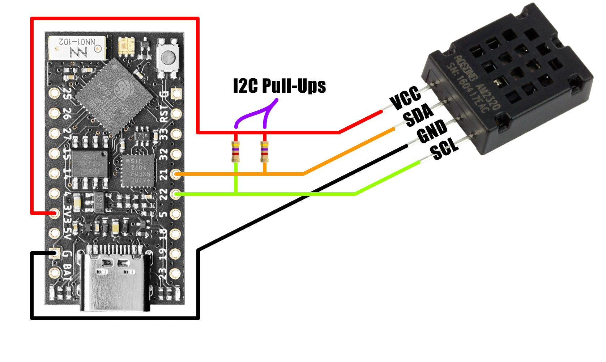

# Контроллер лампы SmartLampESP32

Контроллер лампы SmartLampESP32 представляет из мебя устройство, которое может выполнять следующие действия:

*   Подключаться к сети WiFi в режиме WiFi\_STA (лампа подключается у точке доступа).
*   Выступать в режиме WiFi\_AP (лампа сама выступает в роли точки доступа).
*   Включать и выключать освещение по команде.
*   Включать и выключать асвещение по таймеру.
*   Измерять температуру и влажность.
*   Измерять и сохранять температуру и влажность в течении суток.
*   Получать время с сервера времени ntp.

## Подготовка к использованию

В проекте используются:

*   Плата ESP32 WeMos LOLIN32 Lite.
*   Цифровой датчик температуры и влажности Aosong AM2320.
*   Модуль реле для коммутации нагрузки 110/220 вольт

Подключить датчик AM2320 к соответствующим пинам платы микроконтроллера. Так как используется плата ESP32 WeMos LOLIN32 Lite, то это следующие пины: SDA - 19, SCL - 23 (для других плат ESP32 пины могут отличаться). Подключить питание к AM2320. Подключить модуль реле к соответствующи пинам (по умолчанию In или Sig к пину 23, пины питания VCC и GND)  

**Внимание:** если датчик AM2320 не передает показания, то, вероятно, в нем отсутствуют резисторы на выводах SDA и SCL.  Необходимо подключить резистор 10КОм параллельно выходу SDA и SCA AM2320 и плюсом питания VCC.

